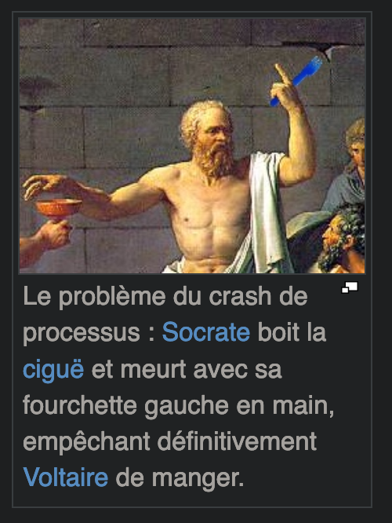
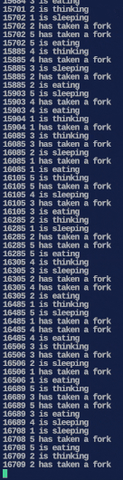

# Description

Multithreading subject inspired by the dining philosophers problem. Constraints are mainly about race condition and deadlocks.
### Philo_one
- Use of threads & mutex
### Philo_two
- Use of thread & semaphores
### Philo_three
- Use of child process, thread & semaphores

# Documentation :green_book:

https://fr.wikipedia.org/wiki/Thread\_(informatique)
https://fr.wikipedia.org/wiki/Multithreading
https://fr.wikipedia.org/wiki/R%C3%A9entrance
https://fr.wikipedia.org/wiki/Section_critique
https://fr.wikipedia.org/wiki/Exclusion_mutuelle
https://fr.wikipedia.org/wiki/D%C3%AEner_des_philosophes
https://fr.wikipedia.org/wiki/S%C3%A9maphore\_(informatique)
https://fr.wikipedia.org/wiki/Interblocage
https://www.geeksforgeeks.org/multithreading-c-2/
https://www.personal.kent.edu/%7Ermuhamma/OpSystems/Myos/threads.htm
https://www.tutorialspoint.com/multithreading-in-c
https://softpixel.com/~cwright/programming/threads/threads.c.php
https://franckh.developpez.com/tutoriels/posix/pthreads/
https://docs.oracle.com/cd/E18752_01/html/816-5137/tlib-1.html
https://docs.oracle.com/cd/E19455-01/806-5257/6je9h032g/index.html
https://hpc-tutorials.llnl.gov/posix/
https://www.notion.so/philosophers-VM-c60be9c836084edfbcd9c07e29b429c4
https://github.com/nesvoboda/socrates
https://highschool.latimes.com/trabuco-hills-high-school/what-is-mutex-and-why-we-should-use-it/
https://stackoverflow.com/questions/22427007/difference-between-pthread-exit-pthread-join-and-pthread-detach
https://hpc-tutorials.llnl.gov/posix/why_pthreads/
https://hpc-tutorials.llnl.gov/posix/what_is_a_thread/
https://hpc-tutorials.llnl.gov/posix/designing_threaded_programs/
https://hpc.llnl.gov/training/tutorials/introduction-parallel-computing-tutorial
http://www.bien-programmer.fr/pthreads.htm
https://www.delftstack.com/howto/c/mutex-in-c/
https://www.thegeekstuff.com/2012/05/c-mutex-examples/
https://thispointer.com/posix-detached-vs-joinable-threads-pthread_join-pthread_detach-examples/
https://homes.cs.washington.edu/~arvind/cs422/lectureNotes/deadlock-6.pdf
https://perso.ens-lyon.fr/michael.rao/ASR2/cours_slides_8.pdf
https://www.ai.univ-paris8.fr/~alinehuf/m1/cours2-3/cours2-3_threads_acces_concurents.pdf
https://man7.org/linux/man-pages/man3/sem_open.3.html
https://www.man7.org/linux/man-pages/man0/sys_stat.h.0p.html
https://see.stanford.edu/materials/icsppcs107/23-Concurrency-Examples.pdf
https://sites.uclouvain.be/SystInfo/notes/Theorie/Threads/coordination.html
https://man7.org/linux/man-pages/man7/sem_overview.7.html
https://www.mkssoftware.com/docs/man3/sem_close.3.asp
https://www.blup.fr/programmation-systeme-en-c-sous-linux/
https://notes.shichao.io/apue/ch8/
https://stackoverflow.com/questions/16400820/how-to-use-posix-semaphores-on-forked-processes-in-c
https://www3.physnet.uni-hamburg.de/physnet/Tru64-Unix/HTML/APS33DTE/DOCU_010.HTM
https://stackoverflow.com/questions/42384398/on-linux-how-to-wait-for-multiple-child-processes
http://www.man-linux-magique.net/man2/waitpid.html
https://www.cs.uic.edu/~jbell/CourseNotes/OperatingSystems/3_Processes.html
